- [Introduction](#introduction)
  * [Why vanilla transformers are not efficient](#why-vanilla-transformers-are-not-efficient)
  * [How to make it efficient](#how-to-make-it-efficient)
- [Task 1: Choosing a model and making it efficient](#task-1-choosing-a-model-and-making-it-efficient)
  * [Which Transformer family to pick from](#which-transformer-family-to-pick-from)
  * [Which approach to choose](#which-approach-to-choose)
    + [What not to choose](#what-not-to-choose)
    + [FNet: the selected approach](#fnet-the-selected-approach)
  * [Implementation](#implementation)
    + [Setting the code](#setting-the-code)
    + [Setting the weights](#setting-the-weights)
    + [Confession of sin](#confession-of-sin)
- [Task 2: fine tuning on GLUE](#task-2-fine-tuning-on-glue)
  * [Selected fine-tuning tasks](#selected-fine-tuning-tasks)
  * [Fine-tuning code](#fine-tuning-code)
  * [Hyperparameters](#hyperparameters)
  * [Results](#results)
    + [Time-space performance](#time-space-performance)
    + [Paying for our sins: NLU performance](#paying-for-our-sins-nlu-performance)
- [Further work](#further-work)

# Introduction

## Why vanilla transformers are not efficient

The main efficiency bottleneck in Transformer models is its self-attention mechanism.

In short:

- This due to the fact that each token representation is updated by attending to all token in the sentence (attending to all token in a Encoder, and the leftwards tokens in a Decoder).

In more detail:

- Fact 1:
    - If $A \in \mathbb{R}^{p\times q}$, $B \in  \mathbb{R}^{q\times r}$, then the matrix multiplication $C = AB \in  \mathbb{R}^{p\times r}$:
        - has time complexity $O(pqr)$.
            - Each element $C_{ij} = \sum\limits_{k=1}^{q} A_{ik}B_{kj}$ requires $O(q)$ computations.
            - We have to compute $pr$ such elements $\implies O(pqr)$.
        - has space complexity $O(pr)$.
            - The space required to store the elements in $AB$.
- Fact 2:
    
    Following ([Vaswani et a., 2017](https://arxiv.org/pdf/1706.03762.pdf)) and assuming that:
    
    - $X \in \mathbb{R}^{n \times d_{\text{model}}}$, where
        - $X$ — the input embeddings.
        - $n$ — sequence length, and
        - $d_{\text{model}}$ — the model embedding dimension.
    - $W_i^Q, W_i^K \in \mathbb{R}^{d_\text{model}\times d_k}$.
    - $W_i^V \in \mathbb{R}^{d_\text{model}\times d_v}$ (often $d_v = d_k = d$).
    
    then (single head) attention is defined as:

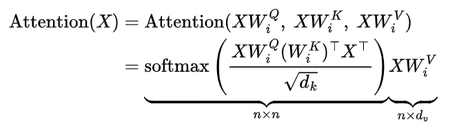

Since $XW_i^Q,\ XW_i^K \in \mathbb{R}^{n\times d_k} \implies$ from Fact 1 it follows that the matrix multiplication $XW_i^Q(XW_i^K)^\top$ has time complexity $O(nd_k n) = O(n^2)$ and space complexity $O(n^2)$ with respect to sequence length.

Therefore, training Transformer-based models can be prohibitively costly, specially on long sequences.

## How to make it efficient?

Different approaches has been proposed to improve the efficiency of training these models. Among them:

- Incorporate structural priors on attention such as
    - sparsity ([Child et al. 2019](https://arxiv.org/abs/1904.10509v1)).
    - pooling-based compression ([Rae et al. 2020](https://openreview.net/forum?id=SylKikSYDH)).
    - clustering/binning/convolution techniques, which applies $k$-means clustering to learn dynamic sparse attention regions (e.g. [Roy et al. 2020](https://arxiv.org/abs/2003.05997)).
- Restrict the attention mechanism to attend to local neighborhoods ([Parmar et al. 2018](http://proceedings.mlr.press/v80/parmar18a.html))
- Using a *Reformer* approach ([Kitaev et al. 2020](https://arxiv.org/pdf/2001.04451.pdf))
    - where locality sensitive hashing is used to group together tokens of similar embeddings)
- Sliding windows ([Beltagy et al. 2020](https://arxiv.org/abs/2004.05150))
- Truncated targeting ([Chelba et al. 2020](https://arxiv.org/abs/2001.04589))

# Task 1: Choosing a model and making it efficient

## Which Transformer family to pick from

First, the choice of the Transformer model depends on the downstream tasks we are asked to trained the model on. 

Since we’ll need to test the models in some language understanding tasks (GLUE) we have to choose a Transformer ***text*** model.

The variety of Transformer-base text model is vast. A survey may be more exhaustive but some models can be found [here](https://huggingface.co/docs/transformers/index#supported-models).

In general, they can be further subdivided depending on whether they rely solely on the encoder, the decoder or both. This also ultimately defines the array of tasks they can be applied to $\implies$ the choice depends on the architecture.

For simplicity’s sake we chose BERT, mainly for two reasons:

1. Its architecture is not complex. Moreover, it’s faithfully based on the original Transformer implementation of ([Vaswani et a., 2017](https://arxiv.org/pdf/1706.03762.pdf)), which we thought would make simpler to modify the self-attention sub-layer.
2. Modifying the attention sub-layer implies influencing the representation power of the model. At this point we thought that an encoder-based model would be simpler to manipulate in comparison to only-decoder or encoder-decoder models.
    - Otherwise, we’d need not only take care of changing the self-attention sub-layer in some way, but also making the cross-attention work (in hopefully some meaningful way).

The given choice (BERT) also affects the possible approaches we can pursue in making the transformer more efficient. More detail in next section.

## Which approach to choose

- General approaches taken to deal with the attention bottleneck were outlined above.

### What not to choose

- Given the encoder-based nature of BERT (and the nature of the downstream task) we’re prompted to not to choose some approaches, among them:
    - Autoregressive methods:
        - Such as the ones discussed in  [Finetuning Pretrained Transformers into RNNs](https://arxiv.org/abs/2103.13076) and [Transformers are RNNs: Fast Autoregressive Transformers with Linear Attention](https://arxiv.org/abs/2006.16236).
        - Reason:
            - Although there are BERT variants modified to run text generation task (e.g. [Rothe et al. 2020](https://arxiv.org/abs/1907.12461)), we decided not to pursue that approach, since the downstream tasks on GLUE are more related to Natural Language Understanding than to pure generation.
    - Linformer ([Wang et al. 2020](https://arxiv.org/abs/2006.04768)):
        - Idea:
            - Approximate self-attention with an approximate low-rank matrix.
            - In other words, project $KW_i^K,\ VW_i^V \in \mathbb{R}^{n\times d}$ into a lower dimensional space using linear projections with matrices $E_i, F_i \in \mathbb R^{n×k}$, where $i$ stand for the $i$-th layer in the Encoder.
        - Drawback:
            - It assumes a fixed sequence length. In other words, for every possible sequence length $n_j$ we’d need a new pair of matrices $E_i, F_i \in \mathbb R^{n_j×k}$ (either for the whole model, if we set $E_i = E$ and $F_i = F$, or for every encoder layer).
            - We could have just padded every batch to `max_seq_length`, and set $n_j =$ `max_seq_length`but we chose not to do that, assuming it may be harmful for dowstream performance.
    - Reformer ([Kitaev et al. 2020](https://arxiv.org/abs/2001.04451)):
        - Idea:
            - Use a multi-round hashing scheme when computing dot-product attention, which in theory reduces the self-attention complexity to $O(n \log(n))$.
        - Drawback:
            
            
            - Their complexity term has a large constant $128^2$ and it is only more efficient than the vanilla transformer when sequence length is extremely long ([Wang et al. 2020](https://arxiv.org/pdf/2006.04768.pdf))
        
    - Sparse Transformer and Block give attention (e.g. [Child et al. 2019](https://arxiv.org/abs/1904.10509v1)):
        - Idea:
            - Reduce the attention dot-product computation to just a subset of the query-key values.
        - Drawback:
            - It leads to performance degradation.

### FNet: the selected approach

- Source: [Lee-Thorp et al. 2021](https://arxiv.org/abs/2105.03824).

To be concise, the paper proposes to replace the self-attention sub-layer completely with a Fourier Transform layer:

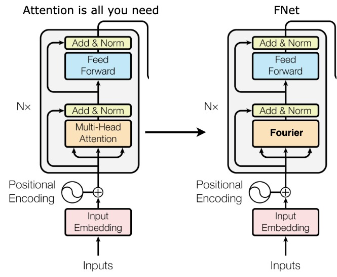

The computed Fourier Transform is 2D: along the sequence-length dimension and along the embedding dimensions. That is, for a matrix $X$ with elements $x_{rs}$ that would be similar to this:

$$
A_{kl} =  \sum_{r=0}^{n-1} \sum_{s=0}^{d_{\text{model}}-1} x_{rs}\exp\left [ -2\pi i \left({rk\over n}+{sl\over d_{\text{model}}}\right)\right ]
$$
  
  where $k \in [0, n-1],\ l = [0, d_{\text{model}}-1]$.
    
In this way, the time complexity is reduced from $O(n^2)$ to $O(n\log n)$, if the Fourier Transform is implemented with the FFT algorithm.

The space complexity depends on the FFT implementation:
- If recursive, then $O(n\log n)$.
- If iterative, then $O(n)$.
- We’ll assume that the PyTorch implementations in `torch.fft` is efficient, so we expect a linear space complexity.

## Implementation

### Setting the code

To implement this approach we decided to extend the HuggingFace’s (HF) `transformers` library for two reasons:

1. By suggestion, we are not supposed to write the whole architecture from scratch and only modify the needed layers $\implies$ the less we code we write the better (:
2. For practical purposes we would like to spend as less time as possible implementing all the necessary code for fine-tuning (preprocessing datasets, creating the training loop, evaluating, plotting, etc). `transformers` provides a high-level interface that takes care of all that pretty easily by using its `Auto` and `Trainer` classes).

For this reason the code is in separate repository ([https://github.com/Joqsan/transformers](https://github.com/Joqsan/transformers)) and not inside this project.

We know that HF’s `transformers` already include the FNet model (see [here](https://huggingface.co/docs/transformers/model_doc/fnet)) but, as expected, we ignore it and opt to:

1. Begin with a copy of their BERT code. See [commit 8ffbcff](https://github.com/Joqsan/transformers/commit/8ffbcff3d2bb5176d070757e42a94e910a3e5f38). Copy-pasted from [here](https://github.com/Joqsan/transformers/blob/fnet/src/transformers/models/bert/modeling_bert.py).
2. Change the self-attention sub-layer as describe above (see image). In the transformers codebase this amounts to:
    1. Modifying the corresponding `PreTrainedConfig` subclass to match the FNet hyperparameters.
    2. Replacing `BertSelfAttention`.
    
    All this is done in [commit dd08150](https://github.com/Joqsan/transformers/commit/dd0815078f6de971cabc9cec7ce580f4b4eb92a0)
    
    ✅ We also change the class name to avoid conflicting with the names in `modeling_bert.py`. See [commit 823bb6e](https://github.com/Joqsan/transformers/commit/823bb6e0f821420a225fb4dcfb8ef7a9dcbcd28b).
    

### Setting the weights

- We initialize the weights of a `MyFNetModel` to the pre-trained weights of a `BertModel.from_pretrained("bert-base-uncased")` model.
- We host the weight on HF Hub for easily loading the them for the downstream fine-tuning tasks.
    - Code for loading the `state_dict` and pushing to the Hub can be found [here](models/my_fnet/load_bert_weights_and_push_fnet_to_hub.ipynb).
    - The corresponding checkpoint hosted in HF Hub: [here](https://huggingface.co/Joqsan/custom-fnet/tree/main).

<aside>
⛔ To run the experiments, this notebook doesn’t need to be run.

</aside>

### Confession of sin

Usually when modifying inner layers in a model we need to fine-tune it in some pre-training task before fine-tuning it in downstream ones (for example, the same task the previous pre-trained weights were obtained from).

Even when doing so, some authors still got drops in performances and recommend training the whole model from scratch ([Kasai et al. 2021](https://arxiv.org/pdf/2103.13076.pdf))

In our case, we replace the self-attention layer with unparametrized Fourier Transform layers $\implies$ we don’t have weights to tune inside these layers $\implies$ the only approach left is to pre-train the whole model from scratch, which is what the FNet authors did.

Due to limitation of computational resources pre-training our FNet is too costly, so as in the previous section we decided to use the weights of a pre-trained BERT as starting point for our downstream fine-tuning. 

Although we still expect an improvement in computation time across a encoder layer, we also expect a worse-than-expected performance degradation with our FNet. Whether this is the case, we’ll see in the model evaluation below (Spoiler: this was the case ):).

# Task 2: fine tuning on GLUE

GLUE is a collection of diverse natural language understanding tasks. A summarized description all of the tasks can be found in ([Wang et al. 2018](https://arxiv.org/abs/1804.07461)).

## Selected fine-tuning tasks

The tasks we choose were the following:

- **CoLa** — The Corpus of Linguistic Acceptability.
    - Type of task:
        - Binary classification.
    - Input:
        - Single sentence (English sentence).
    - Output:
        - Predict whether the English sentence is grammatically correct or not.
    - Metric:
        - Matthew’s Correlation.

- **QNLI** — Question Natural Language Inference:
    - Built from SQuAD (Stanford Question Answering Dataset)
    - Type of task:
        - Binary classification.
    - Input:
        - pair of (question, answer).
    - Output:
        - Predict whether answer is the answer for question.
    - Metric:
        - Accuracy.

- **RTE** — Recognizing Textual Entailment:
    - A smaller version of MNLI — Multi-Genre Natural Language Inference.
    - Type of task:
        - Classification.
    - Input:
        - pair of sentences.
    - Output:
        - Predict whether the second sentence is an entailment, contradiction, or neutral with respect to the first one.
    - Metric:
        - Accuracy.
    

## Fine-tuning code

The script for fine-tuning can be found [here](https://github.com/Joqsan/bert-vs-fnet/blob/master/models/fine_tuning.py). It can be run on any of the GLUE tasks.

- We run the fine-tuning script on Colab (free GPU). The corresponding notebook can be found here.
- Instructions about how to run it locally can be found [here](Instructions.md).

## Hyperparameters

- We use the same hyperparameters across all tasks and models.
- Optimizer: AdamW.
    
    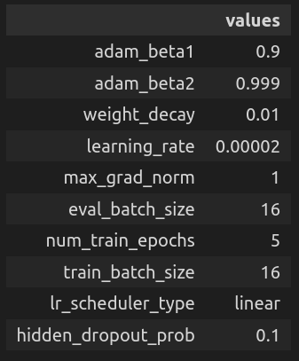
    

## Results

Access to all logging and plots can be found [here](https://wandb.ai/joqsan-a/comparison-bert-fnet?workspace=user-joqsan-a).

### Time-space performance

- For details refer to the tables below.
- In general our custom FNet model perform faster during both training and testing with:
    - ~30% increase in training/test steps done per second and in number of samples processed per second (first and second columns).
    - ~25% decrease in runtime spent during training/testing.
    - The number of operation required to run FNet (`train/total_flos`) also decreased.

**QNLI:**

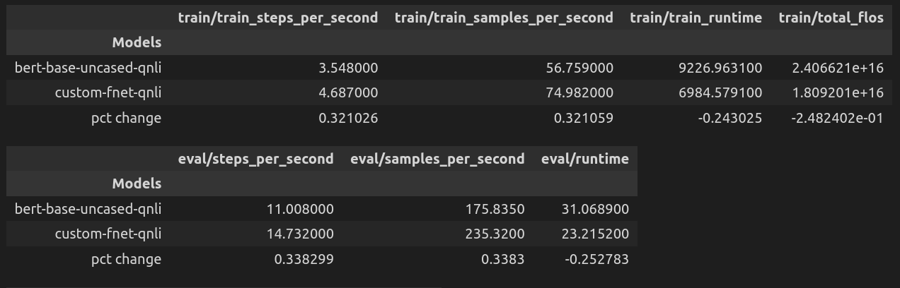

**CoLA:**

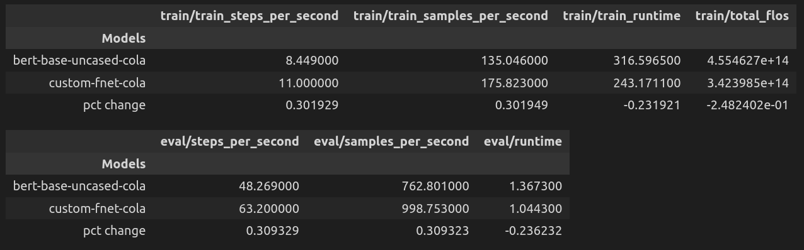

**RTE:**

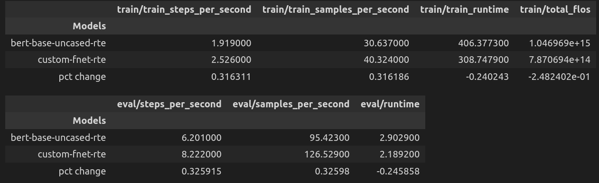

### Paying for our sins: NLU performance

- As in the paper, we can observe performance degradation with respect to the GLUE metrics.
- But in our case we observe substantially performance decrease across all the tasks in comparison to what vanilla BERT achieved after fine-tuning.
    - This may be linked to the fact that we did not carry out any fine-tuning with the whole model to account for the removal of the self-attention layer.
    - For CoLA, Matthew’s correlation = 0, which implies that our FNet model was not able find any relationship between the variables (between the pair of sentences).
- We also note that, not only the loss between FNet and BERT are comparatively different, but the FNet almost did not change after 5 epochs.
    - This shows that the mixing mechanism provided by Fourier Transform (although more efficient) cannot fully replace the representation power produced by vanilla Transformer.

**QNLI:**

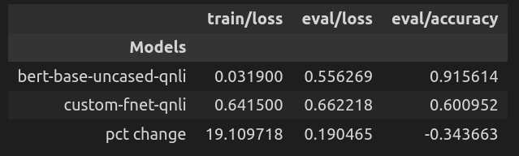

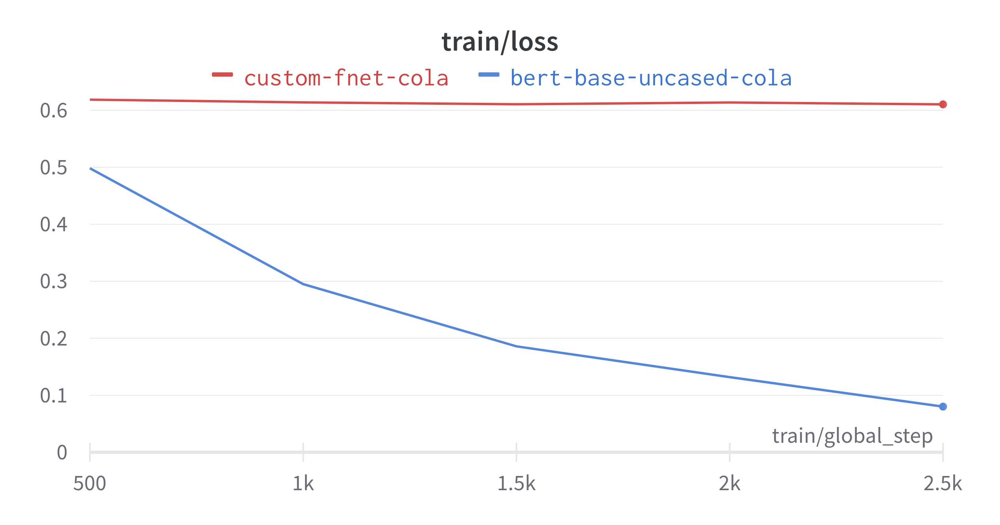

**CoLA:**

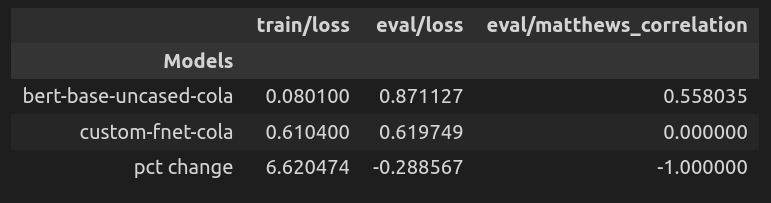

**RTE:**

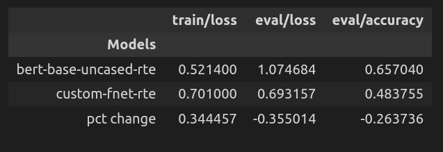

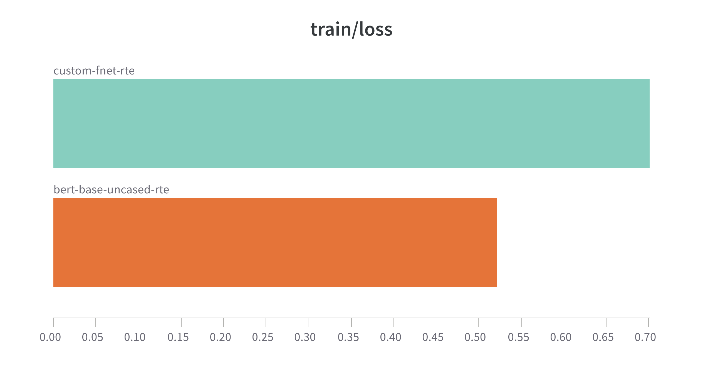

# Further work

There are a number of step that can be taken in order to extend/complement the above analysis, such as:

- Redeem our sins: pre-train the full FNet model from scratch and repeat the downstream fine-tuning to compare how it performs against vanilla BERT and the naive FNet version discussed above.
- Compare the models’ time and space performance with respect to sequence length.
- Include other approaches for improving efficiency, that are non-orthogonal to FNet, such as using mix precision.
